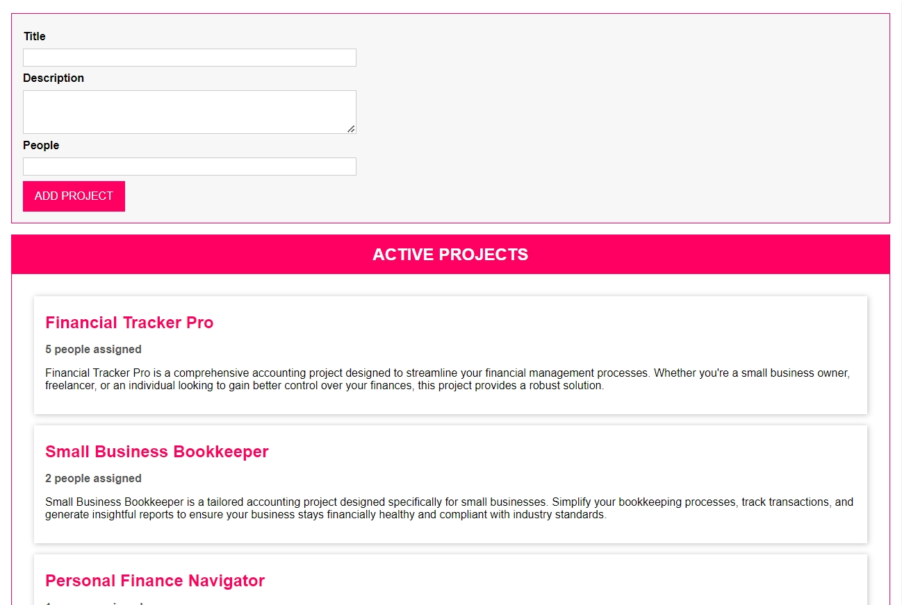
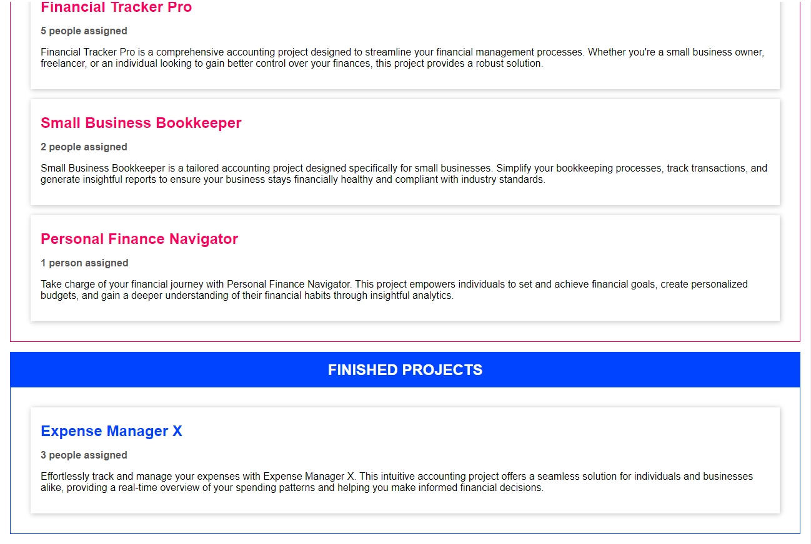
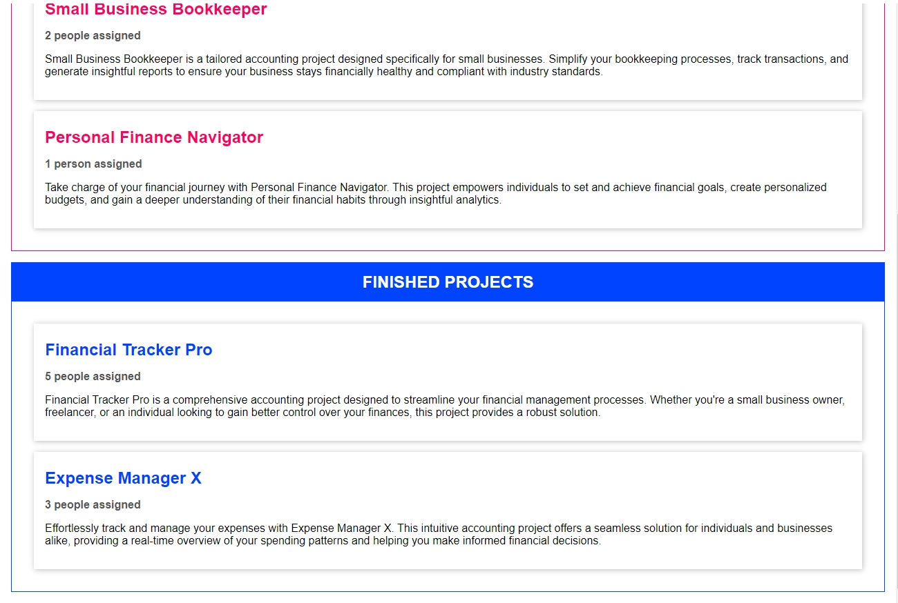

# Drag and drop project app
A simple TypeScript app that lets you create a project note and drag and drop it between "active" and "finished" lists. Created during attended courses.

## Features
While using this app users can:
* Create a project note
* Specify the number of people working on the project
* Add a project description
* Mark project as finished by dragging and dropping the project card in the "finished" list. 

## Screenshots




## Technologies
Project is created with:
* TypeScript

## Setup

### Clone project to your machine:
1. Clone repository:
```
git clone https://github.com/ibabaityte/TS-Drag-and-drop-project.git
```
### Install and setup server:
2. Install dependencies:
```
npm i
```
3. Start server:
```
npm start
```